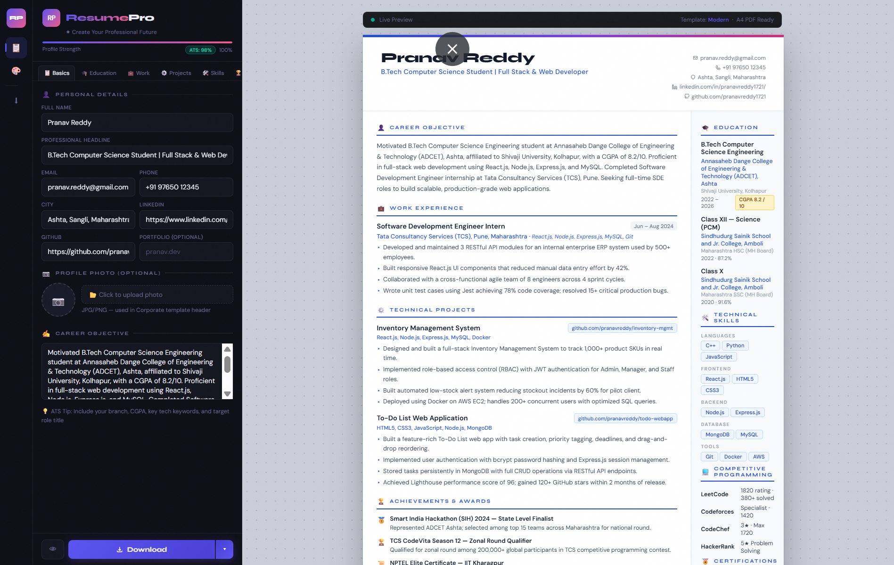

<div align="center">

<br/>

<svg xmlns="http://www.w3.org/2000/svg" width="72" height="72" viewBox="0 0 72 72" fill="none">
  <defs>
    <linearGradient id="g1" x1="0" y1="0" x2="72" y2="72" gradientUnits="userSpaceOnUse">
      <stop offset="0%" stop-color="#6c63ff"/>
      <stop offset="100%" stop-color="#ff6b9d"/>
    </linearGradient>
  </defs>
  <rect width="72" height="72" rx="18" fill="url(#g1)"/>
  <text x="36" y="48" font-family="Georgia, serif" font-size="36" font-weight="900" fill="white" text-anchor="middle">R</text>
</svg>

<br/><br/>

# ResumePro

### *Create Your Professional Future*

<p align="center">
  
  
  
  
  
</p>

<p align="center">
  A <strong>zero-dependency, single-file</strong> resume builder crafted specifically for BTech engineers.<br/>
  Real-time live preview · 3 professional templates · One-click PDF export · No sign-up required.
</p>

<br/>

---

</div>

<br/>

## 📸 Preview

<div align="center">
  
  <br/><br/>
  <em>ResumePro running in the browser — dark editor · live resume preview · instant PDF export</em>
</div>

<br/>

---

## ✨ Features

<table>
<tr>
<td width="50%">

### 🎨 &nbsp;Design & UI
- Dark-mode glassmorphic interface with animated gradient blobs
- 3 resume templates: **Modern**, **Classic**, **Minimal**
- 8 accent colour swatches for instant brand customisation
- Live A4 preview panel updates as you type — zero lag
- Smooth tab-panel transitions with CSS animations

</td>
<td width="50%">

### 📝 &nbsp;Content Sections
- **Basics** — name, headline, contact, photo, career objective
- **Education** — BTech, Class XII (HSC), Class X (SSC), certifications
- **Work** — internships & job experience with tech stack
- **Projects** — technical projects with GitHub links & impact
- **Skills** — one-click chip builder + 40+ preset BTech skills

</td>
</tr>
<tr>
<td width="50%">

### 🏆 &nbsp;Extra Sections
- **Achievements & Awards** — hackathons, SIH, scholarships, patents
- **Positions of Responsibility** — GDSC, E-Cell, IEEE, NSS, fest roles
- **Competitive Programming** — LeetCode, Codeforces, CodeChef, HackerRank
- **Languages Known** — with proficiency levels

</td>
<td width="50%">

### ⚡ &nbsp;Performance & Export
- **Zero dependencies** — single `.html` file, works offline
- **One-click PDF** via `html2pdf.js` — A4, print-perfect output
- **Profile Strength meter** — real-time completeness tracker
- **Fully responsive** — desktop sidebar + mobile topbar layout
- **No login, no data storage** — 100% client-side & private

</td>
</tr>
</table>

<br/>

---

## 🚀 Getting Started

No installation. No build step. No backend.

```bash
# 1. Clone the repository
git clone https://github.com/yourusername/resumepro.git

# 2. Open the file in your browser
open ResumePro.html
```

> Or simply **double-click** `ResumePro.html` — it works entirely in your browser.

<br/>

---

## 🗂️ Project Structure

```
resumepro/
│
├── ResumePro.html        # ← Entire application (HTML + CSS + JS)
├── preview.png           # ← App screenshot for README
└── README.md             # ← You are here
```

> Everything lives in a **single self-contained file**. No node_modules. No bundler. No config.

<br/>

---

## 🖥️ Usage Guide

### Step 1 — Fill Your Details

Navigate through the **7 tabs** in the left editor panel:

| Tab | What to fill |
|-----|-------------|
| 📋 **Basics** | Name, email, phone, city, LinkedIn, GitHub, career objective |
| 🎓 **Education** | BTech degree, HSC (Class XII), SSC (Class X), certifications |
| 💼 **Work** | Internships and job experience with tech stack & impact |
| ⚙️ **Projects** | Technical projects with GitHub links, stack, and metrics |
| 🛠️ **Skills** | Click preset chips or type custom skills |
| 🏆 **Extra** | Achievements, POR, competitive programming profiles, languages |
| 🎨 **Design** | Pick a template and accent colour |

### Step 2 — Customise Design

- Choose **Modern**, **Classic**, or **Minimal** template
- Select one of **8 accent colours** to match your personal brand
- Watch the resume update **live** in the right panel

### Step 3 — Export PDF

Click the **↓ Download PDF** button at the bottom of the editor.  
Your resume downloads as `ResumePro_Resume.pdf` — A4, print-ready.

<br/>

---

## 🎨 Resume Templates

<table>
<tr>
<th align="center">✦ Modern</th>
<th align="center">◈ Classic</th>
<th align="center">◻ Minimal</th>
</tr>
<tr>
<td align="center">Gradient top stripe, two-column layout with side panel. Clean and contemporary.</td>
<td align="center">Dark navy header, off-white sidebar. Traditional, authoritative look.</td>
<td align="center">Bold underline accent, generous whitespace. Understated and elegant.</td>
</tr>
</table>

<br/>

---

## 🛠️ Tech Stack

<p align="center">
  
  &nbsp;
  
  &nbsp;
  
  &nbsp;
  
</p>

<p align="center">
  
</p>

| Technology | Purpose |
|---|---|
| **Vanilla HTML/CSS/JS** | Entire UI — no framework overhead |
| **CSS Custom Properties** | Theming, accent colours, dark mode tokens |
| **CSS Grid & Flexbox** | Responsive two-panel layout |
| **html2pdf.js v0.10.1** | Client-side PDF generation from live DOM |
| **Google Fonts** | Syne (headings) + DM Sans (body) |
| **SVG Icons** | Inline, zero-dependency iconography |

<br/>

---

## 💡 Resume Writing Tips

Built-in tips accessible from the **Design** tab — here's a summary:

```
✅  Keep to 1 page for freshers (2 pages max for 2+ years experience)
✅  Use action verbs: Built · Optimized · Led · Deployed · Reduced
✅  Add metrics: "Reduced load time by 40%" · "500+ daily active users"
✅  Mention CGPA only if 7.5+ (or equivalent percentage)
✅  List 4–6 projects with GitHub links
✅  Add competitive programming ratings (LeetCode / Codeforces)
✅  Tailor your objective for each company you apply to
✅  Include SIH, hackathons, GATE rank if relevant
```

<br/>

---

## 📱 Responsive Layout

| Screen | Layout |
|--------|--------|
| **Desktop (> 900px)** | Icon sidebar + editor panel + live preview |
| **Mobile (≤ 900px)** | Top navigation bar + full-width editor + scrollable preview |

<br/>

---

## 🔒 Privacy

ResumePro is **100% client-side**. Your data:
- ✅ Never leaves your device
- ✅ Never stored on any server
- ✅ Never sent to any API
- ✅ Fully functional offline after first load

<br/>

---

## 🤝 Contributing

Contributions, issues and feature requests are welcome!

```bash
# Fork the repo, make your changes, then open a Pull Request
git checkout -b feature/your-feature-name
git commit -m "feat: add your feature"
git push origin feature/your-feature-name
```

**Ideas for contributions:**
- Additional resume templates
- ATS score checker integration
- Dark/light toggle for preview panel
- Local storage auto-save
- More colour themes

<br/>

---

## 📄 License

```
MIT License — free to use, modify, and distribute.
```

<br/>

---

<div align="center">

**Built with ❤️ for BTech Engineers**

<br/>

<svg xmlns="http://www.w3.org/2000/svg" width="40" height="40" viewBox="0 0 72 72" fill="none">
  <defs>
    <linearGradient id="g2" x1="0" y1="0" x2="72" y2="72" gradientUnits="userSpaceOnUse">
      <stop offset="0%" stop-color="#6c63ff"/>
      <stop offset="100%" stop-color="#ff6b9d"/>
    </linearGradient>
  </defs>
  <rect width="72" height="72" rx="18" fill="url(#g2)"/>
  <text x="36" y="48" font-family="Georgia, serif" font-size="36" font-weight="900" fill="white" text-anchor="middle">R</text>
</svg>

<br/>

*ResumePro — Create Your Professional Future*

<br/>

[](https://github.com/yourusername/resumepro)

</div>
